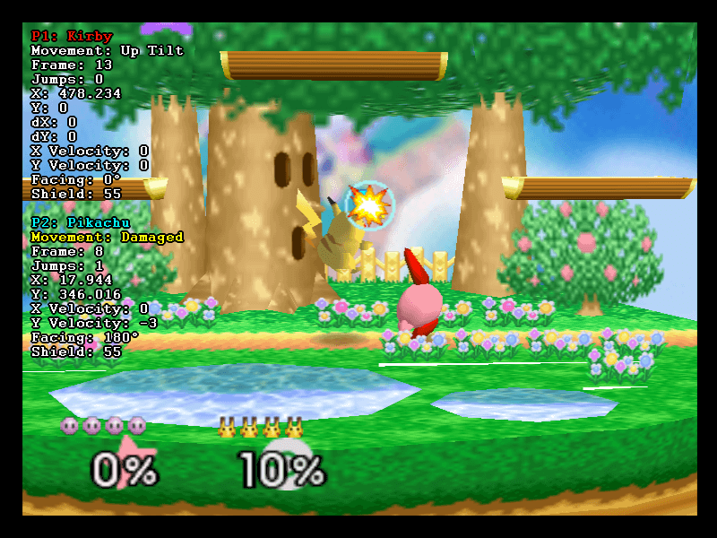
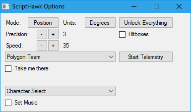

#ScriptHawk
A collection of Lua scripts and RAM watches for [BizHawk](https://github.com/TASVideos/BizHawk) providing many tools to assist with Glitch Hunting and [TASing](http://tasvideos.org). ScriptHawk's Modular API allows new games to be supported easily.

##How to use
###Setup
1. Set up [BizHawk](https://github.com/TASVideos/BizHawk), the latest version is always recommended (and probably required)
2. [Clone this repository](https://help.github.com/articles/cloning-a-repository/) or download and extract a [zipped copy](https://github.com/Isotarge/ScriptHawk/archive/master.zip)
3. Open BizHawk and your (supported) game of choice
4. Click Tools -> Lua Console
5. Open ScriptHawk.lua

###Basic functionality
- Player position, rotation and speed will be displayed on screen
- Press L to levitate and use the D-Pad to move quickly around the map
- Press the E key to levitate and use WASD keys to move quickly around the map
- Press / to reset max velocity, odometer etc.

###Advanced functionality
- The telemetry system records everything shown in ScriptHawk's OSD to the Lua console in CSV format
- Type angleCalc.open() in the Lua console to open a calculator for the angle between 2 points in game, written by [The8bitbeast](https://twitter.com/the8bitbeast)
- Type lock_y = true in the Lua console to freeze the player's Y position, lock_y = false to disable
- Type loadASMPatch() in the Lua console to load a MIPS R4300i assembly patch for any N64 game, huge thanks to [notwa/lips](https://github.com/notwa/lips)

###Writing your own ScriptHawk module
1. Implement the API detailed in [Docs/Design.txt](Docs/Design.txt), a template is provided at [games/blank.lua](games/blank.lua)
2. Your module should reside in the games/ subdirectory
3. Add detection for your game to ScriptHawk.lua
4. Submit a pull request to this repository, or contact [Isotarge](https://twitter.com/Isotarge)

##Supported Games
###Donkey Kong 64
- All known versions supported
- [Object analysis tools](Docs/Object%20Analysis%20Tools.txt): List, Examine, Grab, Focus, Encircle, Zip
- Documentation for over 95% of permanent flags in USA save files
- Realtime feedback for flags being set/cleared
- Mad Jack minimap
- Automatic [ISG](http://dk64.wikia.com/wiki/Intro_Story_Glitch) timer

###Banjo-Kazooie
- All known versions supported
- [Object tracking overlay](https://www.youtube.com/watch?v=m42wiHEdEbU), written by [Mittenz](https://twitter.com/mittenzhugg)
- [Object analysis tools](Docs/Object%20Analysis%20Tools.txt): List, Examine, Grab, Encircle, Zip, Despawn
- Spawn objects
- Documentation for the majority of flags

###Banjo-Tooie
- All known versions supported
- [Object analysis tools](Docs/Object%20Analysis%20Tools.txt): List, Encircle, Zip
- Documentation for over 60% of permanent flags in USA save files
- Realtime feedback for flags being set/cleared

###Conker's Bad Fur Day
- All known versions supported

###Crash Bandicoot
- All known versions supported

###Crash Bandicoot 2: Cortex Strikes Back
- All known versions supported

###Crash Bandicoot 3: Warped
- All known versions supported

###Diddy Kong Racing
- All known versions supported
- [Object analysis tools](Docs/Object%20Analysis%20Tools.txt): List, Examine, Encircle, Zip
- Autotapper, written by [Faschz](https://twitter.com/Faschz) with various improvements

###Space Station Silicon Valley
- All N64 versions supported

###Super Mario 64
- All known versions supported
- [Object analysis tools](Docs/Object%20Analysis%20Tools.txt): List, Examine, Zip

###Super Smash Bros.
- All known versions supported

###Toy Story 2: Buzz Lightyear to the Rescue
- Europe (N64)
- France (N64)
- German 1.0 and 1.1 (N64)
- USA (N64)

###Ocarina of Time & Majora's Mask
While ScriptHawk does have basic support for OoT and MM there are people who are much more dedicated to these games than I will ever be. Check out the great work at the following GitHub repos for more comprehensive support:
- [notwa/mm](https://github.com/notwa/mm/tree/master/Lua)
- [RainingChain/Z64LuaHooks](https://github.com/RainingChain/Z64LuaHooks)
- [mattpilla/Majora-s-Mask-Lua-Scripts](https://github.com/mattpilla/Majora-s-Mask-Lua-Scripts)
- [glankk/gz](https://github.com/glankk/gz)

##Partially Supported Games
- Elmo's Number Journey (N64 only)
- Elmo's Letter Adventure (N64 only)
- Rayman 2 (N64 only)
- San Francisco Rush 2049 (N64 only)

##Other Included Scripts
- [Alex Kidd in Miracle World](Beta/Miracle%20World.lua) object viewer with drag and drop support
- [Golden Axe Warrior](Beta/Golden%20Axe%20Warrior.lua) object viewer with drag and drop support
- [Golvellius](Beta/Golvellius.lua) object viewer with drag and drop support
- [The Ninja](Beta/The%20Ninja.lua) (SMS) object viewer with drag and drop support
- [Tetris Attack](Tetris%20Attack%20Bot.lua) bot, plays the game quite well using a simple sorting algorithm
- [Mr. Driller 2](Beta/Drillbot.lua) bot
- [remove_klump.lua](Beta/remove_klump.lua), [code golf](https://en.wikipedia.org/wiki/Code_golf) that removes Klumps from DK64 USA version
- [Legend of Galahad](Beta/Galahad.lua) object viewer, written by [The8bitbeast](https://twitter.com/the8bitbeast)
- [Wonder Boy III](Beta/Wonder%20Boy%20III%20RNG%20Watch.lua) RNG watch, written by [The8bitbeast](https://twitter.com/the8bitbeast)
- Dega .MMV reader

##Other Notable BizHawk + Lua Projects
- Banjo-Kazooie [MittenzHugg/Banjo-KazooC](https://github.com/MittenzHugg/Banjo-KazooC)
- GoldenEye [Wyst3r/GoldenEye](https://bitbucket.org/Wyst3r/bizhawklua)
- Mario Kart 64 [weatherton/BizHawkMarioKart64](https://github.com/weatherton/BizHawkMarioKart64)
- Super Mario World [rodamaral/smw-tas](https://github.com/rodamaral/smw-tas)
- Pokémon Red & Yellow [kylecoburn/PokéBot](https://github.com/kylecoburn/PokeBot)

##Support me
If you like my work, consider [donating](https://streamtip.com/t/isotarge)