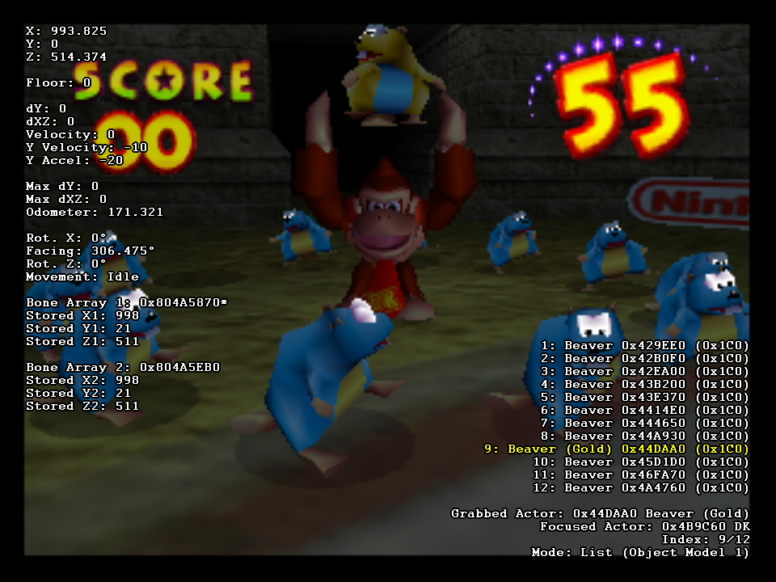
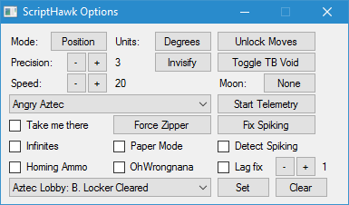
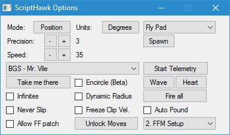
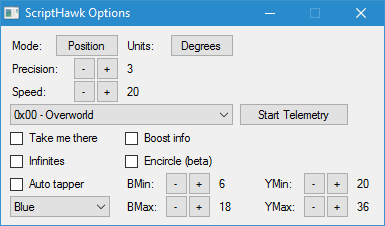

#ScriptHawk
A collection of Lua scripts and RAM watches for [BizHawk](https://github.com/TASVideos/BizHawk) providing many tools to assist with Glitch Hunting and [TASing](http://tasvideos.org). ScriptHawk's Modular API allows new games to be supported easily.

##How to use
###Setup
1. Set up [BizHawk](https://github.com/TASVideos/BizHawk) and run the prerequisite installer, the latest version is always recommended but a bare minimum of 1.11.7 is required
2. [Clone this repository](https://help.github.com/articles/cloning-a-repository/) or download and extract a [zipped copy](https://github.com/Isotarge/ScriptHawk/archive/master.zip) into a ScriptHawk folder inside the Lua folder that comes with BizHawk
3. Open BizHawk and your (supported) game of choice
4. Click Tools -> Lua Console
5. Open ScriptHawk.lua

###Basic functionality
- Player position, rotation and speed will be displayed on screen
- Use L to levitate and the D-Pad to move quickly around the map

###Writing your own ScriptHawk module
1. Implement the API detailed in Docs/Design.txt, a template is provided at games/blank.lua
2. Your module should reside in the games/ subdirectory
3. Add detection for your game to ScriptHawk.lua
4. Submit a pull request to this repository, or contact [Isotarge](https://twitter.com/Isotarge)

##Supported Games
###Donkey Kong 64
- All known versions supported
- [Object analysis tools](Docs/Object%20Analysis%20Tools.txt): List, Examine, Grab, Focus, Encircle, Zip
- [Bone displacement](http://bombch.us/Bn1C) fix & detection
- Documentation of over 95% of permanent flags in USA save files
- Mad Jack minimap
- Automatic [ISG](http://dk64.wikia.com/wiki/Intro_Story_Glitch) timer

###Banjo-Kazooie
- All known versions supported
- Spawn objects (currently USA 1.0 and PAL only)
- [Object analysis tools](Docs/Object%20Analysis%20Tools.txt): List, Examine, Encircle, Zip

###Banjo-Tooie
- All known versions supported

###Conker's Bad Fur Day
- All known versions supported

###Diddy Kong Racing
- All known versions supported
- [Object analysis tools](Docs/Object%20Analysis%20Tools.txt): List, Examine, Encircle, Zip
- Autotapper, written by [Faschz](https://twitter.com/Faschz) with various improvements

###Super Mario 64
- All known versions supported
- [Object analysis tools](Docs/Object%20Analysis%20Tools.txt): List, Examine

###Toy Story 2: Buzz Lightyear to the Rescue
- Europe (N64)
- France (N64)
- German 1.0 and 1.1 (N64)
- USA (N64)

###Ocarina of Time & Majora's Mask
While ScriptHawk does have basic support for OoT and MM there are people who are much more dedicated to these games than I will ever be. Check out the great work at the following GitHub repos for more comprehensive support:  
- [notwa/mm](https://github.com/notwa/mm/tree/master/Lua)  
- [RainingChain/Z64LuaHooks](https://github.com/RainingChain/Z64LuaHooks)  
- [mattpilla/Majora-s-Mask-Lua-Scripts](https://github.com/mattpilla/Majora-s-Mask-Lua-Scripts)

##Partially Supported Games
- Elmo's Number Journey (N64 only)
- Elmo's Letter Adventure (N64 only)
- Rayman 2 (N64 USA only)

##Other Notable Scripts
- Alex Kidd in Miracle World object viewer with drag and drop support
- The Ninja (SMS) object viewer with drag and drop support
- Tetris Attack bot, plays the game quite well using a simple sorting algorithm
- Mr. Driller 2 bot
- Dega .MMV reader
- remove_klump.lua, [code golf](https://en.wikipedia.org/wiki/Code_golf) that removes Klumps from DK64 USA version
- Legend of Galahad object viewer, written by [The8bitbeast](https://twitter.com/the8bitbeast)
- Wonder Boy III RNG watch, written by [The8bitbeast](https://twitter.com/the8bitbeast)

##Other Notable BizHawk + Lua Projects
- GoldenEye [Wyst3r/GoldenEye](https://bitbucket.org/Wyst3r/bizhawklua)
- Mario Kart 64 [weatherton/BizHawkMarioKart64](https://github.com/weatherton/BizHawkMarioKart64)
- Super Mario World [rodamaral/smw-tas](https://github.com/rodamaral/smw-tas)
- Pokémon Red & Yellow [kylecoburn/PokéBot](https://github.com/kylecoburn/PokeBot)

##Support me
If you like my work, consider [donating](https://streamtip.com/t/isotarge)